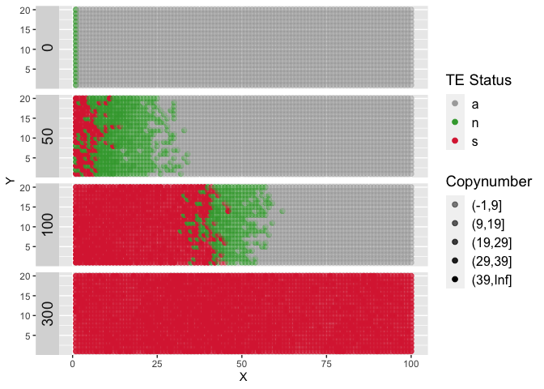

Uniparental overview
================
Robert T. Kofler
12/23/2025

# Basic overview in grid

First generate the simulation

``` bash
./invade --u 0.1 --genome 'MB:2,2,2,2' --rr '4,4,4,4' --grid-x 100 --grid-y 20 --epi-inherit dros --console-format summary --basepop '1-20,1,10' --steps 5 --gen 300 --trigger-defense 40 --file-spatial ~/analysis/2024-spatialsimulations/2025-12-overview-uniparental/basic-overview.ig 
# args: --u 0.1 --genome MB:2,2,2,2 --rr 4,4,4,4 --grid-x 100 --grid-y 20 --epi-inherit dros --console-format summary --basepop 1-20,1,10 --steps 5 --gen 300 --trigger-defense 40 --file-spatial /Users/rokofler/analysis/2024-spatialsimulations/2025-12-overview-uniparental/basic-overview.ig
# version 0.1.8.5, seed: 1766502742927829000
# rep   gen status  phase   |   cte ctens   ctes    avt_wte |   fwte    avw avtes   avpopfreq   fixed   fsilenced   sites   |   denovo  actWX   silWX   |   sampleids
```

Visualise in R

``` r
library(tidyverse)
```

    ## ── Attaching packages ─────────────────────────────────────── tidyverse 1.3.1 ──

    ## ✔ ggplot2 3.3.6     ✔ purrr   0.3.4
    ## ✔ tibble  3.1.7     ✔ dplyr   1.0.9
    ## ✔ tidyr   1.2.0     ✔ stringr 1.4.0
    ## ✔ readr   2.1.2     ✔ forcats 0.5.1

    ## ── Conflicts ────────────────────────────────────────── tidyverse_conflicts() ──
    ## ✖ dplyr::filter() masks stats::filter()
    ## ✖ dplyr::lag()    masks stats::lag()

``` r
df <- read_tsv("/Users/rokofler/analysis/2024-spatialsimulations/2025-12-overview-uniparental/basic-overview.ig") %>% select(-1)
```

    ## Rows: 122000 Columns: 7

    ## ── Column specification ────────────────────────────────────────────────────────
    ## Delimiter: "\t"
    ## chr (2): silenced, denovo
    ## dbl (5): #rep, gen, Y, X, TEs
    ## 
    ## ℹ Use `spec()` to retrieve the full column specification for this data.
    ## ℹ Specify the column types or set `show_col_types = FALSE` to quiet this message.

``` r
# #rep  gen Y   X   TEs silenced    denovo
# 1 0   1   1   0   n   n
# 1 0   1   2   0   n   n

# filter generations
df <-  df %>% filter(gen %in% c(0,  50,  100, 300))
# bin
df$TEbin <- cut(df$TEs, c(seq(0, 40, 10),Inf))
df$status<-df$silenced
df[df$TEs==0,]$status<-'a'

# assign colors
bin_colors <- c("darkgrey", "#3DA53B","#db2c3fff") 

# generate plot
p <- ggplot(df, aes(x = X, y = Y)) +
  geom_point(aes(alpha = TEbin, color = status), size = 2) +
  scale_color_manual(values = bin_colors) +  # Use discrete bins
  scale_alpha_ordinal(range=c(0.5,1.0))+
  facet_grid(rows = vars(gen), switch = "y") +
  theme(axis.text = element_blank(),
        axis.ticks = element_blank(),
       axis.title = element_blank(),
        strip.text.y = element_text(size = 14),
        strip.text.x = element_text(size = 14),
        legend.title = element_text(size = 14),  # Legend title size
       legend.text = element_text(size = 12)) +
  labs(color = "TE Status", alpha = "Copynumber")
# save to file
plot(p)
```

<!-- -->

``` r
ggsave("/Users/rokofler/gh/SpatialSimulation/Robert/2025-unip-overview/overview.eps", plot = p, width = 8, height = 10, units = "in", dpi = 100)
```

    ## Warning in grid.Call.graphics(C_points, x$x, x$y, x$pch, x$size): semi-
    ## transparency is not supported on this device: reported only once per page
